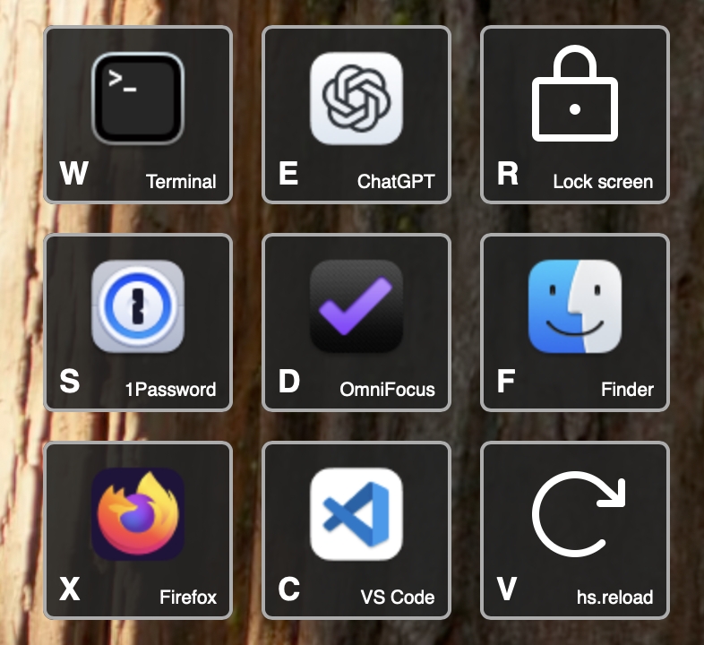

# GridCraft

An action menu based on Starcraft 2 Grid Hotkeys

## Installing

1.  Copy this directory to your HammerSpoon config
2.  Install a local copy of [Phosphor icons](https://phosphoricons.com/)
    ```sh
    cd GridCraft/phosphor
    npm install
    ```
3.  Define your grid configuration

## Configuring

See how I use it in [my Hammerspoon `init.lua`](../init.lua).

Here's a simplified example.
This one makes a small 3x3 grid for the keys:

```text
W E R
S D F
X C V
```

It looks like this:



```lua
local GridCraft = require("GridCraft")

GridCraft.modal(
  -- The hokey to invoke this is ctrl-shift-f11
  { "ctrl", "shift" },
  "f11",
  -- Now we have a table of tables to represent the grid.
  -- (Lua has a data structure called "tables" which can array-like, as we have them here.
  -- They can also be associative key=value tables, but we don't need to know about those to configure GridCraft.)
  -- Our 3x3 grid has 3 rows, and each row has 3 keys
  {
    -- The table for the top row
    {
      -- Regular applications passed with appName pull the icon from the application
      GridCraft.action { key = "w", appName = "Terminal" },
      GridCraft.action { key = "e", appName = "ChatGPT" },
      -- Here's a more complicated action
      GridCraft.action {
        key = "r",
        -- You can make custom actions by passing any Lua function to the action parameter,
        -- even one you define yourself!
        -- Here we use one that is built in to Hammerspoon that will lock the screen.
        action = hs.caffeinate.lockScreen,
        actionDesc = "Lock screen",
        -- To use a Phosphor icon, pass the icon name and weight.
        -- Phosphor icons are automatically colored the same color as the description text.
        icon = GridCraft.iconPhosphor("lock", "regular")
      },
    },
    -- The table for the middle row
    {
      GridCraft.action { key = "s", appName = "1Password" },
      GridCraft.action { key = "d", appName = "OmniFocus" },
      GridCraft.action { key = "f", appName = "Finder" },
    },
    -- The table for the bottom row
    {
      GridCraft.action { key = "x", appName = "Firefox" },
      -- By default it displays the application name, override that with actionDesc
      GridCraft.action { key = "c", appName = "Visual Studio Code", actionDesc = "VS Code" },
      GridCraft.action {
        key = "v",
        action = hs.reload,
        actionDesc = "hs.reload",
        -- The icon can be anything that returns a <svg> or  tag.
        -- This one is using a raw Phosphor icon to show how it works.
        -- (In lua, strings starting with [[ and ending with ]] can include single and double quotes,
        -- as well as newlines, so they are convenient for HTML/SVG elements.)
        icon = [[<svg xmlns="http://www.w3.org/2000/svg" viewBox="0 0 256 256"><rect width="256" height="256" fill="none"/><polyline points="184 104 232 104 232 56" fill="none" stroke="currentColor" stroke-linecap="round" stroke-linejoin="round" stroke-width="16"/><path d="M188.4,192a88,88,0,1,1,1.83-126.23L232,104" fill="none" stroke="currentColor" stroke-linecap="round" stroke-linejoin="round" stroke-width="16"/></svg>]]
      },
    },
  },
  -- This a title that is just nice for logging in the Hammerspoon console.
  "GridKeys Example"
)
```

## Notes

- You can encode an image file as base64 and include it inline, like this:
  `"data:image/svg+xml;base64," .. Util.base64("/path/to/your-icon.png")`

## Recommendations

Get a keyboard with programmable keys running [QMK](https://qmk.fm/) or [ZMK](https://zmk.dev/)
and put an F-key somewhere easy to reach.
